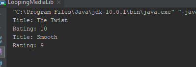
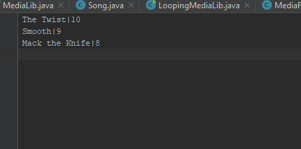
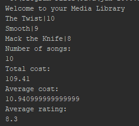

------------------------------------------------------------------------ 
This is the project README file. Here, you should describe your project. 
Tell the reader (someone who does not know anything about this project) 
all he/she needs to know. The comments should usually include at least: 
------------------------------------------------------------------------

<h2>PROJECT TITLE:1.2.1</h2>

# Lesson 1.5
<li>PURPOSE OF PROJECT: Parsing text                 </li>
<li>VERSION or DATE: 3/10/20                         </li>
<li>HOW TO START THIS PROJECT:                       </li>
<li>AUTHORS: Tavius Sterling                         </li>
<li>USER INSTRUCTIONS:                               </li>

#3  

#?  EXAMPLE Insert question you are answering here 

#?  EXAMPLE Insert question you are answering here 

#?  EXAMPLE Insert question you are answering here 

#?  EXAMPLE Insert question you are answering here 

------------------------------------------------------------------------ 
This is the project README file. Here, you should describe your project. 
Tell the reader (someone who does not know anything about this project) 
all he/she needs to know. The comments should usually include at least: 
------------------------------------------------------------------------

# Lesson Insert Number Here
<li>PURPOSE OF PROJECT:                              </li>
<li>VERSION or DATE:                                 </li>
<li>HOW TO START THIS PROJECT:                       </li>
<li>AUTHORS:                                         </li>
<li>USER INSTRUCTIONS:                               </li>

#?  EXAMPLE Insert question you are answering here 

#?  EXAMPLE Insert question you are answering here 

#?  EXAMPLE Insert question you are answering here 

------------------------------------------------------------------------ 
This is the project README file. Here, you should describe your project. 
Tell the reader (someone who does not know anything about this project) 
all he/she needs to know. The comments should usually include at least: 
------------------------------------------------------------------------

# Lesson Insert Number Here
<li>PURPOSE OF PROJECT:                              </li>
<li>VERSION or DATE:                                 </li>
<li>HOW TO START THIS PROJECT:                       </li>
<li>AUTHORS:                                         </li>
<li>USER INSTRUCTIONS:                               </li>

#?  EXAMPLE Insert question you are answering here 

#?  EXAMPLE Insert question you are answering here 

#?  EXAMPLE Insert question you are answering here 

------------------------------------------------------------------------ 
This is the project README file. Here, you should describe your project. 
Tell the reader (someone who does not know anything about this project) 
all he/she needs to know. The comments should usually include at least: 
------------------------------------------------------------------------

# Lesson Insert Number Here
<li>PURPOSE OF PROJECT:                              </li>
<li>VERSION or DATE:                                 </li>
<li>HOW TO START THIS PROJECT:                       </li>
<li>AUTHORS:                                         </li>
<li>USER INSTRUCTIONS:                               </li>

#?  EXAMPLE Insert question you are answering here 

#?  EXAMPLE Insert question you are answering here 

#?  EXAMPLE Insert question you are answering here 

------------------------------------------------------------------------ 
This is the project README file. Here, you should describe your project. 
Tell the reader (someone who does not know anything about this project) 
all he/she needs to know. The comments should usually include at least: 
------------------------------------------------------------------------

# Lesson Insert Number Here
<li>PURPOSE OF PROJECT:                              </li>
<li>VERSION or DATE:                                 </li>
<li>HOW TO START THIS PROJECT:                       </li>
<li>AUTHORS:                                         </li>
<li>USER INSTRUCTIONS:                               </li>

#?  EXAMPLE Insert question you are answering here 

#?  EXAMPLE Insert question you are answering here 

#?  EXAMPLE Insert question you are answering here 

------------------------------------------------------------------------ 
This is the project README file. Here, you should describe your project. 
Tell the reader (someone who does not know anything about this project) 
all he/she needs to know. The comments should usually include at least: 
------------------------------------------------------------------------
